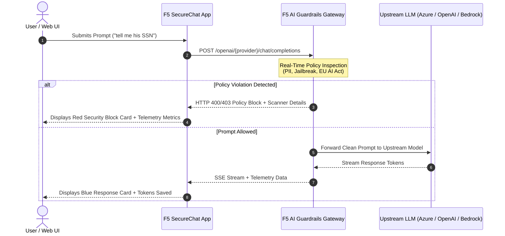
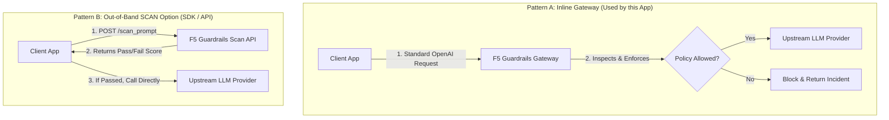

# F5 SecureChat Enterprise 🛡️🤖

**F5 SecureChat Enterprise** is a modern, enterprise-grade AI Chat Application workspace protected by **F5 AI Security Guardrails**. Built with FastAPI, asynchronous Server-Sent Events (SSE) streaming, and Vanilla CSS, it provides real-time threat detection, PII/SSN data loss prevention, prompt injection blocking, and interactive security telemetry analysis.

---

## 🌟 Key Features

* **🛡️ Real-Time F5 Guardrails Protection**: Automatically inspects user prompts and LLM completions against configured security packages including Prompt Injection, PII Core, EU AI Act compliance, and Restricted Topics.
* **📊 Live Security Telemetry & Inspection**: Every message bubble in chat history is interactive—click any message to inspect its exact risk score, triggered scanner, confidence rating, incident ID, and latency.
* **⚡ Token Savings Analytics**: Displays real-time estimated token savings (`~Est. Tokens Saved`) to quantify cost avoidance from blocked malicious or excessive responses.
* **🔄 Zero-Restart Provider Auto-Discovery**: Automatically queries the F5 Guardrails Management Plane to resolve active model providers (`Azure OpenAI`, `OpenAI`, `Bedrock`, `OpenRouter`). Includes a manual **`🔄 Sync Provider`** control button in the left-hand toolbar.
* **🎨 Modern Responsive UI System**: Features split-view Guardrails Analysis panel, blue transparent response cards for allowed completions, red transparent security block cards for policy violations, and a custom **☀️ / 🌙 theme switch pill**.
* **💬 Chat History Management**: Local storage session persistence with one-click trash can deletion and immediate new session thread creation.

---

## 🏛️ Architecture & F5 AI Guardrails API Integration

### How F5 SecureChat Enterprise Integrates with F5 Guardrails

Instead of forcing developers to manage separate SDK integrations or direct provider API keys, **F5 SecureChat Enterprise** uses F5 AI Security Guardrails as an **Inline OpenAI-Compatible Gateway / Proxy**:

1. **Unified Endpoint Protocol**: The application sends standard OpenAI Chat Completions requests to F5 Guardrails at:
   `https://<f5-portal-url>/openai/<active-provider-name>/chat/completions`
2. **Inline Real-Time Inspection**: Before reaching the LLM, F5 AI Guardrails evaluates the prompt against active security packages (PII Core, Prompt Injection, Restricted Topics, EU AI Act).
3. **Automated Enforcement**:
   * **If Allowed (HTTP 200)**: F5 Guardrails routes the prompt to the backing LLM provider (Azure OpenAI, AWS Bedrock, OpenAI) and streams tokens back to the user.
   * **If Blocked (HTTP 400/403)**: F5 Guardrails drops the request, prevents LLM execution, and returns detailed security violation details.

---

### Request & Response Flow Diagrams

#### **Inline Gateway Flow (Used by F5 SecureChat Enterprise)**



---

### Architecture Comparison: Inline Gateway vs. Out-of-Band SCAN API

F5 AI Security Guardrails supports two integration patterns. **F5 SecureChat Enterprise utilizes Pattern A**:



| Feature / Property | Pattern A: Inline Gateway Proxy *(This App)* | Pattern B: Out-of-Band SCAN Option *(SDK)* |
| :--- | :--- | :--- |
| **Integration Complexity** | **Zero-Code Change** (OpenAI drop-in URL) | Requires custom SDK / dual API calls |
| **Credential Management** | App only holds F5 key (LLM keys secured in F5) | App must manage F5 key AND LLM keys |
| **Latency Impact** | Minimal (Single hop proxy streaming) | Higher (Two separate HTTP round-trips) |
| **Enforcement Guarantee** | **100% Guaranteed** (LLM is unreachable directly) | Risk of developer bypass if scan call skipped |
| **Scope for This App** | **IN SCOPE** | Out of Scope |

---

## 📋 Prerequisites

1. **Docker & Docker Compose** (Recommended) OR **Python 3.11+** OR **Kubernetes Cluster (with Helm 3)**.
2. An active **F5 AI Security Guardrails** tenant account.

---

## 🛠️ How to Create a Project & API Key in F5 AI Guardrails GUI

Follow these step-by-step instructions to set up your security project in the F5 Management Console:

### Step 1: Log Into the F5 Guardrails Portal
Navigate to your enterprise **F5 AI Security Guardrails Portal** and sign in with your administrator credentials.

### Step 2: Create a New Security Project
1. In the left navigation sidebar, click **Projects**.
2. Click **+ New Project** in the top right.
3. Enter a project name (e.g., `f5-securechat-enterprise`) and optional description.
4. Click **Create**.

### Step 3: Enable Security Scanners
In your project settings under **Scanner Settings**, add scanners from the following pre-built security packages or create your own custom guardrail:
* **EU AI Act package**
* **Restricted topics package**
* **PII core package**
* **Prompt injection package**

### Step 4: Configure Upstream Model Provider Profiles
1. Navigate to **Provider Profiles** under Project Settings.
2. Click **Add Provider** and select your model deployment (e.g. `Azure OpenAI`, `OpenAI`, or `AWS Bedrock`).
3. Enter your provider API credentials and deployment details.
4. Mark the provider as **Default** and ensure it is **Enabled**.

### Step 5: Generate Credentials
1. Under Project Settings, click **API Keys**.
2. Click **Generate API Key**.
3. Copy both values immediately:
   * **Project ID**
   * **API Key**

---

## 🚀 Deployment Options

### Option 1: Docker Compose Quickstart

1. **Clone the Repository**:
   ```bash
   git clone https://github.com/thnguyenf5/f5-securechat-enterprise.git
   cd f5-securechat-enterprise
   ```

2. **Configure Environment Variables**:
   Copy `.env.example` to `.env`:
   ```bash
   cp .env.example .env
   ```
   Edit `.env` with your F5 Guardrails credentials:
   ```env
   F5_AI_GUARDRAILS_API_KEY="your_f5_guardrails_api_key_here"
   F5_AI_GUARDRAILS_PROJECT_ID="your_f5_guardrails_project_id_here"
   F5_AI_GUARDRAILS_BASE_URL="https://your-f5-guardrails-portal-url"
   PORT=8000
   ```

3. **Launch Container**:
   ```bash
   docker-compose up -d
   ```
   Open **`http://localhost:8000`** in your browser!

---

### Option 2: Kubernetes Deployment via Helm ⛵

The repository includes a cloud-native, vendor-agnostic Helm chart under `./chart/f5-securechat-enterprise`.

#### **1. Basic Helm Installation**:
```bash
helm install f5-securechat ./chart/f5-securechat-enterprise \
  --set env.apiKey="your_f5_api_key" \
  --set env.projectId="your_f5_project_id" \
  --set env.baseUrl="https://your-f5-portal-url"
```

#### **2. Helm Installation with Ingress Enabled**:
```bash
helm install f5-securechat ./chart/f5-securechat-enterprise \
  --set env.apiKey="your_f5_api_key" \
  --set env.projectId="your_f5_project_id" \
  --set env.baseUrl="https://your-f5-portal-url" \
  --set ingress.enabled=true \
  --set ingress.hosts[0].host="chat.example.com"
```

#### **3. Helm Installation with Gateway API (`HTTPRoute`)**:
```bash
helm install f5-securechat ./chart/f5-securechat-enterprise \
  --set env.apiKey="your_f5_api_key" \
  --set env.projectId="your_f5_project_id" \
  --set env.baseUrl="https://your-f5-portal-url" \
  --set gatewayApi.enabled=true \
  --set gatewayApi.gatewayName="nginx-gateway"
```

---

## ⚙️ Environment Variables Reference

| Variable Name | Description | Required | Default / Example |
| :--- | :--- | :---: | :--- |
| `F5_AI_GUARDRAILS_API_KEY` | API Key generated in F5 Guardrails Console | **Yes** | `your_f5_api_key_here` |
| `F5_AI_GUARDRAILS_PROJECT_ID` | Project UUID from F5 Guardrails Console | **Yes** | `your_f5_project_id_here` |
| `F5_AI_GUARDRAILS_BASE_URL` | Base URL of your F5 Guardrails Portal | **Yes** | `https://your-f5-portal-url` |
| `F5_AI_GUARDRAILS_ENDPOINT` | Custom proxy URL override | No | *Auto-discovered via API* |
| `PORT` | Web application listening port | No | `8000` |

---

## 📸 Application Screenshots

| Dark Mode Split-View Workspace | Light Mode Workspace |
| :---: | :---: |
|  |  |

---

## 🔒 Security & Privacy Notice

* **Zero Hardcoded Secrets**: This codebase contains zero hardcoded API keys or project IDs. All credentials are supplied via environment variables or local `.env` files (which are git-ignored).
* **Local Session Storage**: Chat history and telemetry logs are stored in the user's browser `localStorage` and never transmitted to third-party tracking services.

---

## 📄 License
Distributed under the MIT License. See `LICENSE` for more information.
